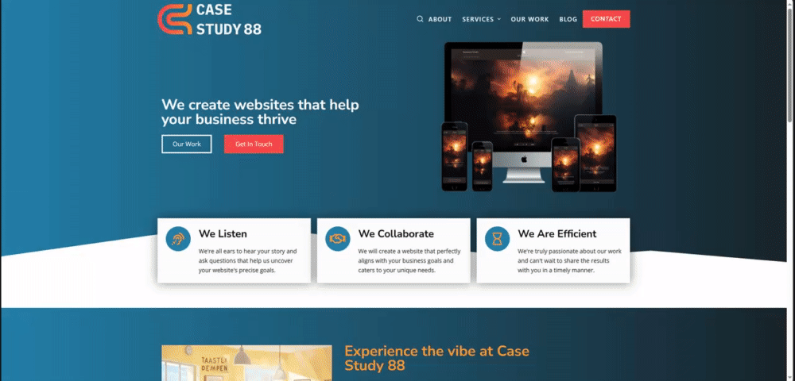

# Case Study 88 - A Proposal

This repository contains a WordPress static website proposal created to showcase and present a front-end facelift for a design firm. The website has been built using the Blocksy theme and Elementor, providing a visually appealing and interactive presentation of the proposed changes.



## Table of Contents

- [Demo](#demo)
- [Features](#features)
- [Installation](#installation)
- [Customization](#customization)
- [Contributing](#contributing)
- [License](#license)

## Demo

To view the live demo of the proposal website, visit [Demo Link](https://mattycalimbas.github.io/case-study-88/).

## Features

- **Modern Design**: The website demonstrates a modern and aesthetically pleasing design, reflecting the proposed facelift for the design firm.

- **Interactive Elements**: Elementor has been used to create engaging and interactive sections to showcase design concepts and improvements.

- **Easy Customization**: The Blocksy theme and Elementor make it easy to customize the content, layout, and styling to tailor the proposal to the client's needs.

- **Responsive**: The website is fully responsive, ensuring a seamless viewing experience on various devices and screen sizes.

- **SEO-Friendly**: WordPress and Blocksy provide SEO-friendly features to optimize the website for search engines, helping it rank higher in search results.

- **A.I. Imagery via MidJourney**: Incorporating AI-generated imagery from Midjourney in our WordPress facelift proposal provides visuals that demonstrate design, setting a new standard for inspiration and innovation.

## Installation

To set up this WordPress static website locally for development or customization, follow these steps:

1. Clone this repository to your local machine:

   ```bash
   git clone https://github.com/MattyCalimbas/case-study-88.git
   ```

2. Install WordPress on your local server environment. You can use tools like XAMPP, WAMP, or MAMP for this purpose.

3. Import the content from the repository into your WordPress installation:
   - Navigate to the WordPress admin dashboard.
   - Go to Tools > Import.
   - Choose "WordPress" and follow the instructions to import the content from the cloned repository.

4. Activate the Blocksy theme and Elementor plugin within your WordPress admin dashboard.

5. Customize the content and design as needed to tailor the proposal to your specific project.

## Customization

Content, design, and layout can be customized according to the specific needs and preferences. You can use the Elementor drag-and-drop page builder to easily make changes to the website's pages.

## Contributing

Contributions are welcome! If you have any improvements or suggestions for this proposal website, please open an issue or submit a pull request. Your feedback and contributions will be greatly appreciated.

## License

This project is licensed under the [MIT License](LICENSE.md).

### Disclaimer:

This application showcases design awards and accolades for a fictitious website. All awards, honors, and recognitions featured within this application are entirely fictional and have no basis in reality. Any resemblance to real design awards or websites is purely coincidental.

This application is intended for demonstration purposes only. It is not meant to mislead or deceive users into believing that the depicted design awards are real or associated with any actual website.

The creators of this application do not claim any affiliation with or endorsement from any genuine design award organizations. The use of fictitious awards is a creative element for the purpose of this application.
